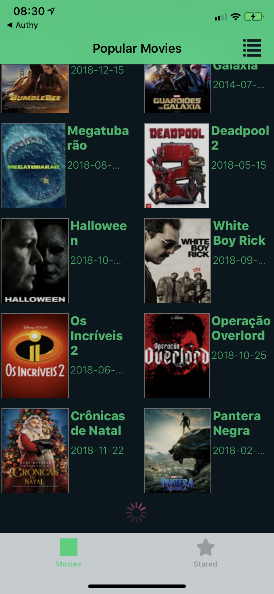

# Movies WhishList

- App testado somente no iOS 12+ em iPhone XR
- Instruções para rodar o app
	- Clonar a branch no git hub
	- É necessário ter instalado no macos o cocoapods
		- ````sudo gem install cocoapods````
	- Entrar na pasta do projeto e digitar pod install
	- Abrir o projeto no xcode através do arquivo
		- `MoviesWhishList.xcworkspace`
	- Clicar em play no xcode.


## Screenshots


<p align="center">

</p>

<p align="center">

</p>
<p align="center">

</p>
<p align="center">

</p>
<p align="center">

</p>
<p align="center">

</p>
<p align="center">

</p>
<p align="center">

</p>
